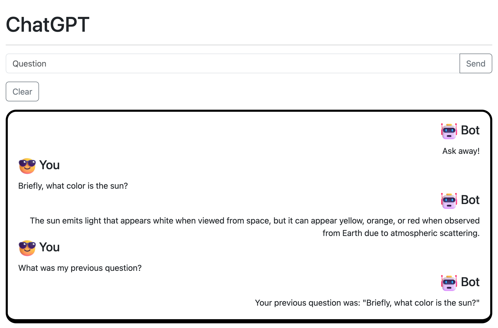

# Minimal Chat UI

Powered By ChatGPT, file based history.

# Preview:

### Terminal
Start the server

[terminal.mov](terminal.mov)

### ChatUi
Start chatting

[chatui.mov](chatui.mov)

# Installation

- pip install -r requirements.txt

